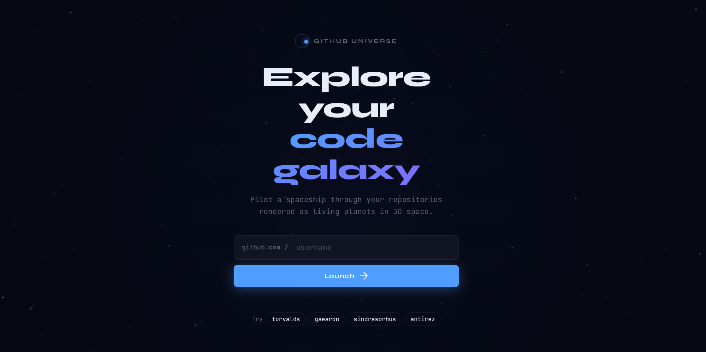

<div align="center">
  

  <h1>🚀 GitHub Universe 3D v2</h1>

  <p><strong>A game-like 3D galaxy explorer where GitHub repositories become living planets inside a dynamic universe.</strong></p>

  <p>Instead of browsing repositories in a list, you <strong>pilot a spaceship</strong> and explore them like a space game.</p>

  <p>Built using <strong>JavaScript, Three.js, and modern web technologies</strong>.</p>
  <br/>
</div>

---

# 🌐 Live Preview

You can preview the project live by visiting the link below:

### 👉 [Launch GitHub Universe 3D](https://github-universe-bynandan.netlify.app/) 👈

---

# 🎥 Demo Video

Check out the interactive capabilities, including the new Cinematic Mode and Mobile Support, in action:


*(Click the image above to watch the demo video `demo.gif`)*

---

# 🌌 Project Overview

This project transforms repositories from **GitHub** into a fully navigable **3D galaxy**.

Each repository becomes a **planet** with visual properties based on repository data.

Examples:

- ⭐ **Stars → Planet brightness**
- 🍴 **Forks → Planet rings**
- 💻 **Language → Planet color**
- 📦 **Repository size → Planet size**
- 📈 **Activity → Orbiting moons**

Users can **fly a spaceship through the galaxy** and inspect repositories interactively.

---

# ✨ Features

- **Interactive 3D Galaxy:** Explore GitHub repositories as a living, breathing 3D universe.
- **Dynamic Planet Generation:** Planets are procedurally generated based on real-time repository data.
- **Spaceship Navigation:** Pilot a spaceship with smooth physics and controls to explore the galaxy.
- **Cinematic Mode:** Press `C` or toggle the UI to fade out the interface and enjoy a pure, uninterrupted space view.
- **Constellation View:** Connect repositories by programming language to see language clusters.
- **Comets and Cosmic Dust:** Experience a dynamic universe with moving comets and ambient cosmic dust.
- **Multiple Visualization Modes:** View the galaxy by default orbit, clustered by language, ordered by stars, or ordered by recent activity.
- **Seamless Mobile Support:** Redesigned responsive UI to gracefully support browsing repositories from mobile devices with virtual joysticks and scrollable navigation.

---

# ⚡ Quick Start

1. Clone or download the repository

```bash
git clone https://github.com/YOUR-USERNAME/github-universe-3d.git
```

2. Open the project folder

3. Open the file

```
index.html
```

in your browser.

No installation required.  
No backend required.  
Runs completely in the browser.

---

# 🎮 Controls

## Desktop

| Input | Action |
|------|------|
| `W A S D` | Move spaceship |
| `Space / Shift` | Move up / down |
| Mouse drag | Look around |
| Scroll wheel | Adjust speed |
| `E` | Inspect planet |
| `Escape` | Close panel |

---

## 📱 Mobile Controls

Mobile devices use **dual virtual joysticks** powered by **NippleJS**.

- **Left joystick** → spaceship movement
- **Right joystick** → camera look
- **Swipe** → rotate view
- **Inspect button** → view repository info

The experience feels like a **mobile space exploration game**.

---

# 🪐 Planet System

Each repository becomes a unique planet.

| GitHub Data | Planet Feature |
|------|------|
| Repo size | Planet size |
| Language | Planet color |
| Stars | Brightness |
| Forks | Planet rings |
| Activity | Orbiting moons |

---

# 🌌 Galaxy Environment

The galaxy contains multiple space elements:

- Spiral galaxy structure
- Galactic core glow
- 6000 star background
- Colored stars
- Nebula gradient clouds
- Cosmic dust particles
- Rotating black hole

Inactive repositories slowly drift toward the **black hole**.

Recently updated repositories appear as **asteroid trails**.

---

# 🎮 Spaceship Navigation

Users control a **spaceship explorer** with smooth physics.

Features include:

- acceleration
- momentum
- cruise speed
- proximity detection
- warp travel when searching repositories

When approaching a planet, a **holographic information panel** appears.

Information shown:

- repository name
- description
- stars
- forks
- programming language
- last update

---

# 📊 Visualization Modes

Different galaxy layouts allow multiple ways to explore repositories.

| Mode | Layout |
|------|------|
| Galaxy | Default orbital layout |
| Language | Clustered by language |
| Stars | Ordered by popularity |
| Activity | Ordered by recent updates |

---

# 💥 Visual Effects

Advanced visual effects make the universe feel alive.

- Supernova burst for high star repositories
- Constellation lines connecting languages
- Asteroid trails for recent commits
- Black hole gravity
- Planned time-lapse repository evolution

---

# 📁 Project Structure

```
github-universe-3d/

index.html
style.css
main.js
engine.js
ship.js
ui.js
api.js
README.md
```

Description:

```
index.html → main application layout
style.css → futuristic space interface
engine.js → Three.js galaxy rendering engine
ship.js → spaceship movement system
ui.js → interface controls
api.js → GitHub API integration
main.js → application controller
```

---

# ⚡ Performance Optimizations

The project is optimized for smooth rendering.

Features include:

- Three.js cinematic tone mapping
- capped device pixel ratio
- optimized raycasting
- object pooling
- lazy constellation generation
- frame time protection

---

# 🔐 GitHub API Usage

This project uses the public **GitHub API**.

Default limit:

```
60 requests per hour
```

To increase limits, add a token in `api.js`.

```javascript
headers: {
  Accept: 'application/vnd.github.v3+json',
  Authorization: 'token YOUR_GITHUB_TOKEN'
}
```

---

# 🌍 Browser Support

Desktop:

- Chrome
- Firefox
- Safari
- Edge

Mobile:

- Android Chrome
- iOS Safari

---

# 🧠 Development & Credits

**Project Creator**

```
Nandan Das
```

Concept, design, architecture, and main logic were created by **Nandan Das**.

Development involved experimentation, prototyping, and implementation of advanced interactive visualization concepts.

The **core project idea, creative direction, architecture, and gameplay concept were designed and directed by the author**.

---

# 📜 License

This project is licensed under the **MIT License**.

```
MIT License

Copyright (c) 2026 Nandan Das
```

---

# ⭐ Support

If you like the project, consider:

- ⭐ Starring the repository
- 🍴 Forking it
- 🌌 Expanding the universe

---

**Explore your GitHub like a galaxy.**
